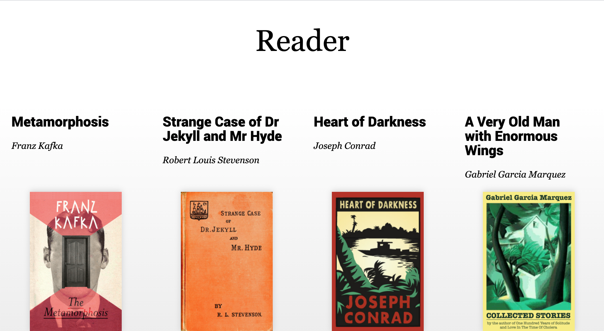

# This repository has been made while learning.

##  Reader : React App

This project was bootstrapped with [Create React App](https://github.com/facebook/create-react-app).

## Screenshot


## Available Scripts

In the project directory, you can run:

```bash
npm i
```
Installs packages that it depends on.

```bash
npm run api
```
Uses json-server with following [routes](./src/api/routes.json).

```bash
npm start
```
Runs the app in the development mode.

```bash
npm test
```
Launches the test runner in the interactive watch mode.
